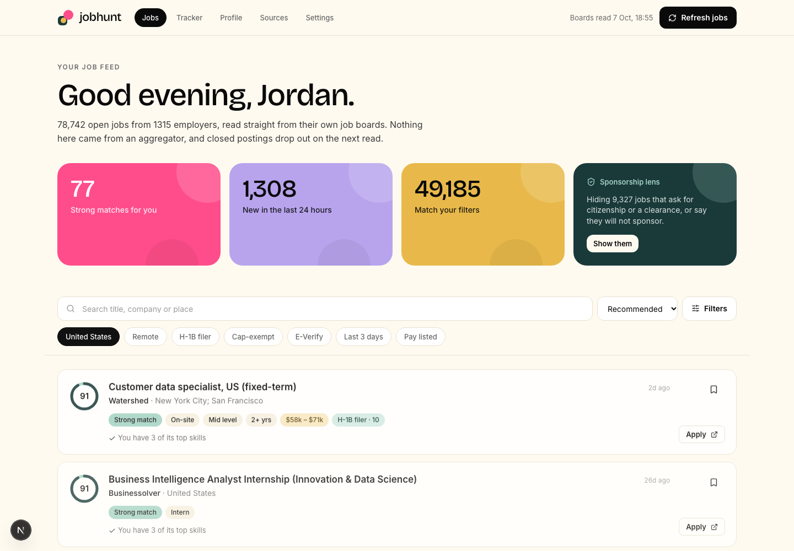
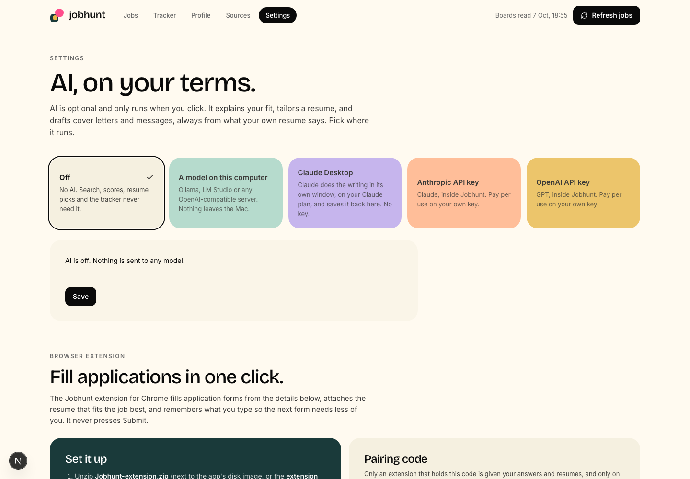

# Jobhunt

A job-search app that runs on your own computer. It reads employers' public job boards straight from the employer, ranks every job against your profile with rules you can read, flags the ones that will or will not sponsor a visa, picks the resume to send, fills the application, and tracks what you applied to.

No account, no database server, no AI key. Your profile, resumes, answers and tracker stay in one file on your machine.



## What it does

- **Reads jobs from the source.** About 2,400 employer boards on Greenhouse, Lever, Ashby, Workday, Workable, iCIMS, Oracle, JazzHR and BambooHR. No aggregators, and a posting that closes drops out on the next read.
- **Ranks them for you.** A match percent built from role, skills and level, with the reason for every number. No model involved: the same profile and posting always give the same score.
- **Knows about work authorization.** Marks employers with recent H-1B filings, likely cap-exempt employers and E-Verify employers, and catches postings that ask for citizenship or a clearance or say they will not sponsor, quoting the posting's own words.
- **Picks the resume.** Keep several resumes (or point it at a folder). Each job shows which one fits best and why.
- **Finds the people.** One click opens a LinkedIn search for your connections at the company, friends of friends, recruiters, or the likely hiring manager.
- **Fills applications.** A Chrome extension fills the form, attaches the right resume, and remembers what you type so the next form needs less of you. It never presses Submit.
- **Writes with AI, if you want it.** Explain your fit, tailor a resume, draft a cover letter or an outreach message, using a model on your own machine, your own API key, or Claude Desktop.
- **Alerts you.** Save any search as an alert. New jobs that match show up on the Alerts page and as a notification on your Mac.
- **Tracks applications.** Saved, Applied, Interviewing, Offer, Rejected, with notes.

## Quick start

You need Node 22.5 or later. SQLite is built into Node, so there is nothing else to install.

```bash
git clone https://github.com/amoakofrimpsdev/jobhunt-main.git
cd jobhunt-main
npm install
npm run dev
```

Open http://localhost:3000.

1. The first visit reads the employer boards, and jobs appear as each board answers. Greenhouse, Lever, Ashby and Workable boards are done in about ten minutes. Workday, iCIMS, Oracle, JazzHR and BambooHR need a request per posting, so their first read runs on in the background for a few hours.
2. Open **Profile**. Add a resume (PDF, Word or text) or type a target title and a few skills, then press **Save and score jobs**.
3. Go back to **Jobs**. The feed is now ranked for you.

The database is `.data/jobhunt.db`. Delete the `.data` folder to start over.

## The Mac app

```bash
npm run dmg
```

This builds `dist/Jobhunt_<version>_<arch>.dmg` and `dist/Jobhunt-extension_<version>.zip`. Open the disk image and drag Jobhunt to Applications.

- It needs Rust: `brew install rustup && rustup default stable`. The first build compiles the shell and takes a few minutes.
- The app is a small [Tauri](https://tauri.app) window around the same local server, with its own copy of Node, so the Mac it runs on needs nothing installed.
- Its data is in `~/Library/Application Support/com.danielfrimpong.jobhunt`, separate from the `.data` folder that `npm run dev` uses.
- The build is signed ad hoc, not with an Apple Developer ID. It opens normally on the Mac that built it. On another Mac, right-click the app and choose Open the first time.

## The Chrome extension

1. Unzip `dist/Jobhunt-extension_<version>.zip`, or use the `extension/` folder as it is.
2. In Chrome open `chrome://extensions`, switch on Developer mode, press **Load unpacked** and choose the folder.
3. In Jobhunt open **Settings**, copy the pairing code, click the Jobhunt icon in Chrome and paste it.

On an application page a small pill appears ("Fill with Jobhunt · 71%"). Click it and the panel opens in Chrome's side panel, docked beside the page so it never covers the form. It stays open as you change tabs and move through an application's steps.

| In the panel | What it does |
|---|---|
| Job and match | The job this page is for and its score. If Jobhunt does not have the job, **Save job** adds it: the employer's whole board on Greenhouse, Lever or Ashby, or the single posting anywhere else. |
| Resume to attach | The best-fitting resume is preselected. Pick another and it tells you which one fits better. |
| Fill application | Fills every field it has an answer for, including custom dropdowns and the resume upload. Fields that already have a value are left alone. |
| Left for you | The questions it could not answer. Click one to jump to it on the page. |
| Recording | What you type by hand is saved and filled in the next time a form asks the same question. Long written answers are offered, not filled in by themselves, because they were written for one employer. |
| Mark applied | Moves the job to Applied in the tracker once you have submitted. |

What it will not do: press Submit, Next or Apply; tick a consent box; read or record passwords, ID numbers or card details. Voluntary demographic answers are remembered only if you tick the box.

On a Chrome older than version 116, which has no side panel, the same panel opens as a floating card on the page. On a site that is not in the built-in list, click the toolbar icon and choose **Use on this page**.

## AI (optional)

Nothing above uses a model. **Settings** offers three ways to add one. It runs only when you press a button under "Write with AI" on a job.



| Option | Where it runs | What you need |
|---|---|---|
| A model on this computer | Ollama, LM Studio or any OpenAI-compatible server. Nothing leaves your machine. | The server running, with a model pulled |
| Your own API key | Anthropic or OpenAI, inside Jobhunt | A key. It is kept in the macOS Keychain, never in the database, never sent to the browser. |
| Claude Desktop | In Claude Desktop, on your Claude plan | Press **Add to Claude Desktop**, then restart Claude Desktop |

Every piece of writing starts from the resume in your library that fits the job best, and the model is told to use only what that resume says. The result is then checked: any skill or figure the resume does not back up is listed above the text for you to verify. Results are text you can edit and copy, and save to your Downloads folder as a PDF, a Word document or plain text. The PDF and Word files are one column of real text in a standard font, which applicant-tracking systems read reliably.

**The Claude Desktop round trip.** Pressing a button on a job opens Claude Desktop with the request. Claude reads the job and your resume through the Jobhunt connector (`mcp/jobhunt-mcp.cjs`, a small Model Context Protocol server), writes, and saves the result back onto the job. Jobhunt has to be open. You can also just ask Claude about your search: it can search the feed, read postings and resumes, and update the tracker.

## Your data

- **Everything is local.** One SQLite file holds the jobs, your profile, resumes, recorded answers and tracker. Set `JOBHUNT_DATA_DIR` to move it.
- **The repository holds no personal data.** `.data/` is ignored by git. Anyone who installs Jobhunt starts with an empty database.
- **Web pages cannot reach the app.** The local server answers only requests addressed to this computer and refuses changes that come from another site.
- **The extension needs a pairing code.** Without it the app gives the extension nothing. The extension stores only that code, and talks to one address: the app on `127.0.0.1`. **Make a new code** in Settings cuts off every extension holding the old one.
- **Network traffic.** Jobhunt contacts the three job-board providers, with no personal data in the request. It contacts an AI provider only if you choose one and press a button. It never contacts LinkedIn, Indeed or Glassdoor; the LinkedIn buttons are plain links your own browser opens.
- **The limit.** Other software running under your own account on your computer can read the database file, as with any local app.

## How it works

**Sources.** Greenhouse, Lever, Ashby and Workable each publish a feed that returns an employer's whole board in one request. Workday, iCIMS, Oracle Recruiting, JazzHR and BambooHR do not: Jobhunt reads the list the employer's own careers page reads, then one request per posting for its text. Those boards are read incrementally. A posting whose text is already held is only marked as still listed; up to 60 new postings per board are read in full on each run, and the rest are saved from the list (title, place, date) and read in full on a later run. Every request carries a plain `jobhunt/<version>` User-Agent and no personal data, at most one a second to any one site. A posting missing from a complete list is closed; a board that fails, or whose list could not be read whole, closes nothing. The feed re-reads the boards when it is opened and the last full read is more than six hours old; the per-posting providers are read once a day.

**Collections.** A collection is a site that lists many employers: a venture firm's portfolio board, a Simplify list on GitHub, a quant job site. Jobhunt does not copy a collection's jobs; it follows the employers' own boards behind it. Eight ship in `data/collections.json`: Andreessen Horowitz, Techstars, Accel, Foundry, Simplify New Grad, Simplify Summer 2027 Internships, a set followed directly in jobleft, and Quant firms (the employers openquant.co and quantbase.fyi list, each checked against its own board feed). Once a week Jobhunt re-reads each collection's own site for employers it has added (`src/lib/collections.ts`): the sitemap, then one page per company it has not seen, looking for the employer's board; for a Simplify list, the list's data file. You can follow another collection by its address on the **Sources** page, check one now, switch one off, or remove it.

**Alerts.** An alert is the feed's current search and filters, saved. After each refresh (and every half minute during a long one) it is run over the jobs that are new since it last ran. The 40 best matches are kept as hits, shown on the **Alerts** page, and announced with a macOS notification. Hits are dropped after a month.

**Facts.** Each posting is read once, when it arrives, by plain text rules (`src/lib/parse`): level, years of experience, work model, pay, country, and what it says about sponsorship, citizenship, clearance and E-Verify, each kept with the sentence it came from. A field the posting does not state is left empty, never guessed.

**Work authorization.** Three signals for people on F-1 OPT or who need H-1B:

- *H-1B filer*: the employer has certified H-1B labor condition applications in recent US Department of Labor disclosure data (`data/h1b-sponsors.json`). This is the employer's history, not a promise for one role.
- *Cap-exempt likely*: the employer's name reads as a university, its hospital or a research nonprofit, which can file H-1B all year, outside the lottery. Confirm with the employer.
- *E-Verify*: the posting says the employer takes part, which a STEM OPT extension needs.

With "I need visa sponsorship" on in your profile, postings that rule sponsorship out are held at 20% and hidden from the feed by default.

**Match.** `src/lib/match.ts` scores role (45%), skills (35%) and level (20%). A part the posting gives nothing to judge by counts as a middling 60, so a job known only by its title cannot reach the top. Recommended order also lifts fresh postings a little and spreads employers out, so one company with twenty openings does not fill the first page.

**Resumes.** The feed is ranked by your main profile. Opening a job scores it against each resume in the library with the same rules, and the panel says which to send and whether it beats the main profile. Two resumes for the same role that differ only in wording score the same; telling those apart needs a language model.

## Project layout

```
src/app/         the screens: Jobs (/), /alerts, /tracker, /profile, /sources, /settings
src/app/api/     local JSON routes the screens, the extension and the connector call
src/components/  Nav, JobCard, JobDrawer, JobWriting
src/lib/         store (SQLite), sources and sources-more (board readers), collections, parse,
                 taxonomy, match, ingest, alerts, resumes, export, ai, connector, ext, answers, people
data/            board directory, collections, H-1B table, skill and job-title taxonomies
extension/       the Chrome extension: engine.js (finds, fills and records fields),
                 content.js (the page side and its pill), view.js + sidepanel.js (the panel),
                 background.js (the only part that talks to the app)
mcp/             the Claude Desktop connector
desktop/         the Mac app's shell (Tauri) and its icon
scripts/         build-dmg.sh, and the scripts that rebuild data/ from a jobleft checkout
legacy/          the first version (Supabase, OpenAI, page scraping). Nothing imports it.
```

Useful commands:

| Command | What it does |
|---|---|
| `npm run dev` | The app at http://localhost:3000 |
| `npm run build` | A production build |
| `npm run typecheck` / `npm run lint` | TypeScript and ESLint |
| `npm run dmg` | The Mac disk image and the extension zip, in `dist/` |

Built with Next.js 16, React 19, Tailwind CSS 4, Node's built-in SQLite and Tauri 2.

## Status

This is a personal project, built quickly, with no automated tests yet. What has and has not been exercised:

| Part | State |
|---|---|
| Reading boards, scoring, filters, tracker, resume library | Exercised against live boards on all nine providers |
| Collections re-read, alerts, PDF and Word export | Each exercised once against live data; exports opened and read back |
| Extension on Greenhouse | Filled a live application form, including custom dropdowns and the resume upload, with nothing submitted |
| Extension on Ashby | Text fields filled on a live form; fixes made afterwards were not re-run there |
| Extension on Lever, Workday and others | Not tested. Workday needs a sign-in to reach the form. |
| Extension as an installed Chrome extension | Tested by injecting its scripts into live pages, not by loading it into Chrome |
| AI with a local model | Tested against a stand-in server, not a real model |
| AI with an Anthropic or OpenAI key | Key storage and error handling tested; no real request made |
| Claude Desktop connector | Tested over its protocol end to end; opening Claude Desktop with the request filled in is untested |
| Mac app | Built and run on Apple silicon only |

Not built yet:

- Readers for the EU hosts of Greenhouse and Lever, and for Personio, Recruitee and SmartRecruiters.
- Importing LinkedIn connections.
- Windows and Linux builds of the desktop app.

## Credits

The approach comes from [jobleft](https://github.com/Blueturboguy07/jobleft): read the employers' own boards instead of scraping pages through a model, keep everything local, score with rules that can explain themselves, and treat sponsorship as a first-class fact.

The H-1B figures come from the US Department of Labor's public LCA disclosure files.

The interface follows the Clay design system from [awesome-design-md](https://github.com/VoltAgent/awesome-design-md): a cream canvas, near-black type and actions, and saturated single-colour cards. The tokens are in `src/app/globals.css`.

## License

[MIT](LICENSE)
